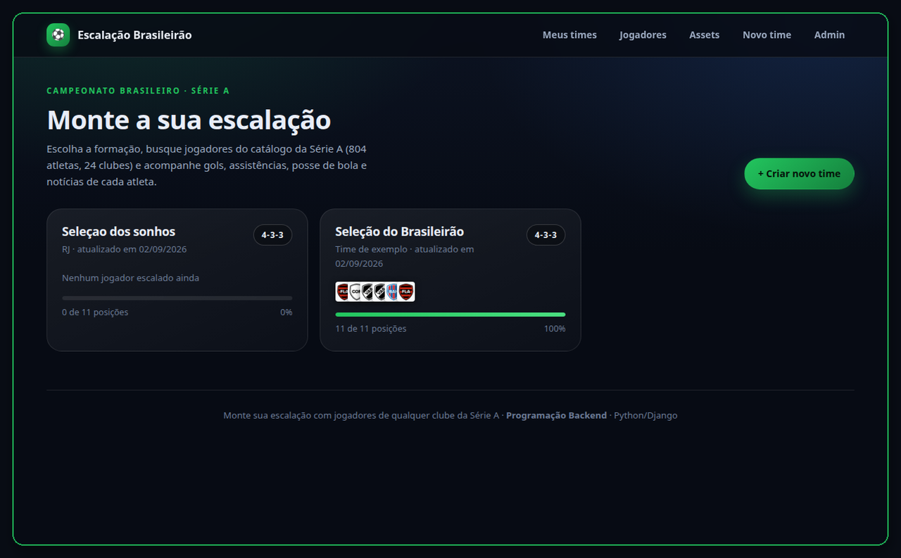
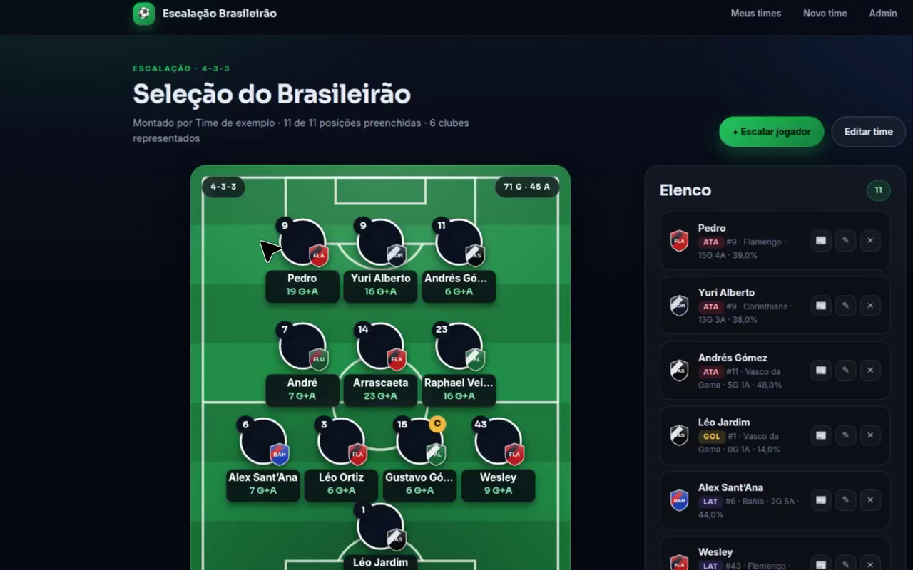
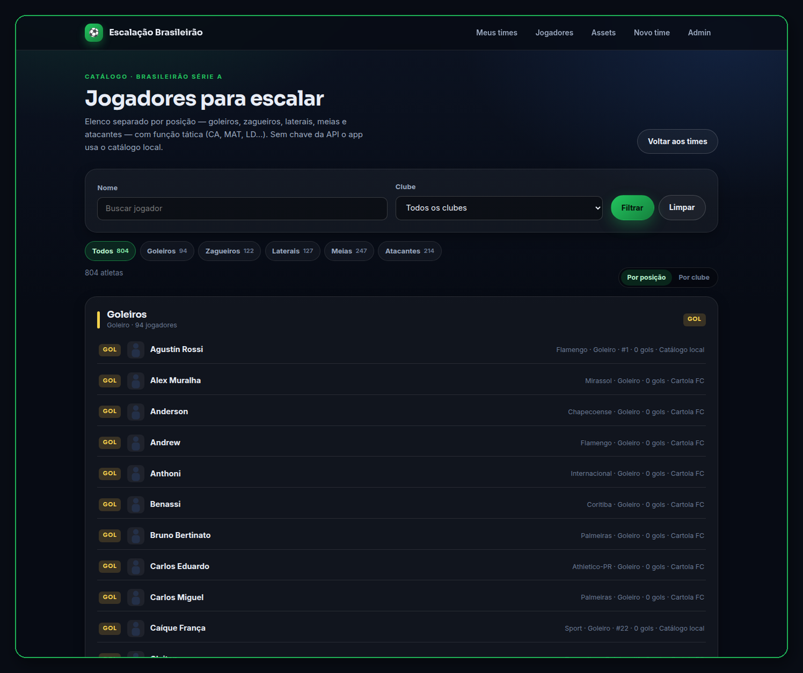
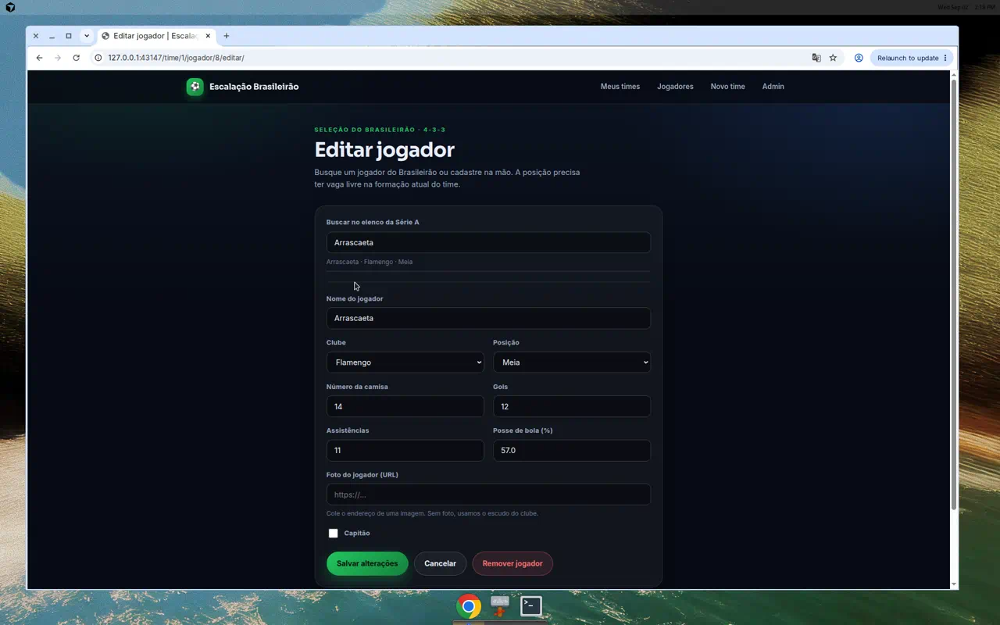
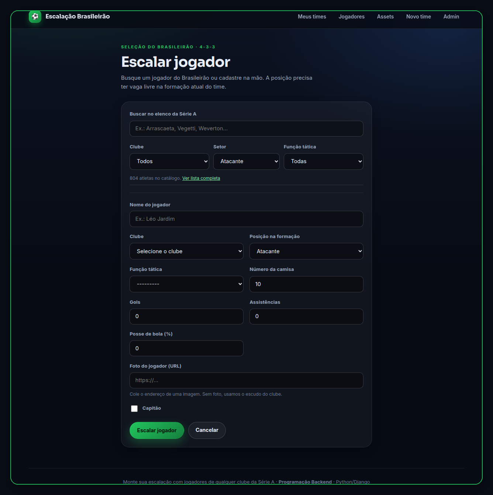

<div align="center">

# ⚽ Escalação Brasileirão

**Monte o seu time com jogadores de qualquer clube da Série A**


[🎬 Demonstração](#-demonstração) ·
[🚀 Instalação](#-instalação-e-execução) ·
[📦 Catálogo](#-como-o-catálogo-funciona) ·
[🔌 API Futebol](#-api-futebol) ·
[🌐 Rotas](#-rotas) ·
[🧪 Testes](#-testes)

</div>

---

## 📋 Sobre o projeto

Aplicação Django em que o usuário monta a própria escalação em um campo de futebol
vertical, no padrão visual dos aplicativos de fantasy game. O time não pertence a um
clube específico: cada jogador é cadastrado com o clube da Série A a que pertence, então
é possível ter um atacante do Flamengo ao lado de um meia do Palmeiras.

O elenco começa no **catálogo local** e pode crescer com o Cartola e a
[API Futebol](https://www.api-futebol.com.br/documentacao) (`sync_api_futebol`
traz a artilharia oficial). No seed acadêmico há 20 clubes; o sync da temporada
atual pode incluir Athletico-PR, Coritiba, Chapecoense e Remo.

Projeto desenvolvido para a disciplina **Programação Backend (Python/Django)**.

---

## ✨ Funcionalidades

| Recurso | Descrição |
|---------|-----------|
| **Times** | Crie quantos times quiser, cada um com nome, torcedor e formação |
| **7 formações** | `3-4-3`, `3-5-2`, `4-3-3`, `4-4-2`, `4-5-1`, `5-3-2` e `5-4-1` |
| **Clubes da Série A** | Escudo, sigla e cores; seed com 20 clubes, sync com o elenco da temporada |
| **Catálogo de jogadores** | Lista em `/atletas/` agrupada por posição, com chips de setor/função e filtro por nome e clube |
| **Busca ao escalar** | Digite o nome no formulário e os campos (clube, posição, função, camisa, gols) preencham sozinhos |
| **API Futebol** | Com `API_FUTEBOL_KEY`, sincroniza a artilharia oficial (`campeonato_id = 10`) |
| **Campo interativo** | Vagas livres são clicáveis e já abrem o formulário na posição certa |
| **Estatísticas** | Gols, assistências e posse de bola por atleta, com totais do time |
| **Notícias** | Publique notícias vinculadas a cada jogador |
| **CRUD completo** | Criar, editar e excluir pelo site, sem precisar do painel admin |

### Validação por formação

Cada formação define quantas vagas existem por posição. Ao tentar escalar um jogador
em uma posição sem vaga, o formulário recusa o cadastro e explica o motivo — por
exemplo, um quarto zagueiro em um `4-3-3`, ou um lateral em um `3-5-2`, que não usa
laterais.

---

## 🎬 Demonstração

Capturas só da interface — sem barra do navegador, cursor nem desktop.
Vídeo curto com as cinco telas, em sequência:

<p align="center">
  <video src="docs/assets/demo-escalacao.mp4" poster="docs/assets/demo-campo.png" width="920" controls playsinline></video><br>
  <a href="docs/assets/demo-escalacao.mp4">Assistir o tutorial (MP4)</a>
</p>

### 1. Lista de times

Tela inicial: times criados, formação, escudos e progresso da escalação.

<p align="center">
  
</p>

### 2. Campo interativo

Escalação 4-3-3 no gramado. No elenco ao lado, os jogadores já vêm separados por posição.

<p align="center">
  
</p>

### 3. Catálogo da Série A

Página **Jogadores**: chips de setor (goleiros, zaga, laterais, meias, atacantes)
e lista agrupada por posição. Dá para trocar para “Por clube”.

<p align="center">
  
</p>

### 4. Busca no formulário

Ao escalar ou editar, a busca preenche nome, clube, posição, função, camisa e gols.

<p align="center">
  
</p>

### 5. Cadastro de jogador

CRUD pelo site: clube, posição na formação, função tática, gols, assistências e capitão.

<p align="center">
  
</p>

---

## 🚀 Instalação e execução

### GitHub

```bash
git clone https://github.com/rafaeljs08/escalacao-brasileirao.git
cd escalacao-brasileirao
```

### Origin (Cursor) — só no WSL, macOS ou Linux

No Windows o Origin CLI **não** roda no PowerShell. Use o WSL:

```bash
# Run in WSL (Origin CLI is not available in PowerShell)
# Install the Origin CLI
curl -fsSL https://downloads.cursor.com/origin/install.sh | sh

# Sign in (also sets up git credentials)
origin auth login

# Clone the repository
origin repo clone rafael-junqueira/escalabr
```

Se o comando `origin` não for encontrado:

```bash
echo 'export PATH="$HOME/.local/bin:$PATH"' >> ~/.bashrc
source ~/.bashrc
```

Repositório no Cursor: [cursor.com/codebase/rafael-junqueira/escalabr](https://cursor.com/codebase/rafael-junqueira/escalabr)
(privado; dá para mudar nas configurações da página).
Documentação: [Origin CLI](https://cursor.com/docs/origin/cli)

### Depois do clone

```bash
# 1. Crie e ative o ambiente virtual
python -m venv venv
# Windows (PowerShell)
venv\Scripts\Activate.ps1
# Linux / macOS / WSL
source venv/bin/activate

# 2. Instale as dependências
pip install -r requirements.txt

# 3. Aplique as migrações
python manage.py migrate

# 4. Cadastre os 20 clubes, o catálogo local, os escudos e um time de exemplo
python manage.py seed_brasileirao

# 5. (Opcional) Sincronize a artilharia oficial da API Futebol
#    Cadastre a chave em https://dash.api-futebol.com.br/cadastrar
cp .env.example .env   # edite API_FUTEBOL_KEY
python manage.py sync_api_futebol

# 6. (Opcional) Baixe escudos e fotos públicas (Cartola; sem chave)
python sync.py --dry-run
python manage.py sync_assets

# 7. Inicie o servidor
python manage.py runserver
```

Acesse **http://127.0.0.1:8000/**

### Painel admin

O comando `seed_brasileirao` cria o acesso **padrão do site**. Use no canto
superior direito (**Admin**) ou em `/admin/`:

| Campo | Valor |
|-------|--------|
| **Usuário** | `admin` |
| **Senha** | `admin` |

É só para uso local / trabalho da disciplina. Se for publicar o projeto,
troque a senha com `python manage.py changepassword admin`.

---

## 📦 Como o catálogo funciona

O menu **Jogadores** lista o elenco de referência, separado por posição. Sem chave
da API o app já funciona: `seed_brasileirao` grava o catálogo local dos 20 clubes
(fonte `local`). O sync do Cartola amplia esse elenco e preenche a função tática
quando ela é conhecida. Os chips de setor e função são links GET — funcionam
sem JavaScript.

No formulário de escalação, a busca consulta `/atletas.json` e preenche o cadastro.
A posição escolhida ainda precisa ter vaga livre na formação do time.

---

## 🌐 Rotas

| URL | Método | Descrição |
|-----|--------|-----------|
| `/` | `GET` | Lista os times criados |
| `/time/novo/` | `GET` / `POST` | Cria um time e escolhe a formação |
| `/time/<id>/` | `GET` | Campo com a escalação, estatísticas e notícias |
| `/time/<id>/editar/` | `GET` / `POST` | Edita nome, cartoleiro e formação |
| `/time/<id>/excluir/` | `GET` / `POST` | Exclui o time |
| `/time/<id>/jogador/novo/` | `GET` / `POST` | Escala um jogador |
| `/time/<id>/jogador/<id>/editar/` | `GET` / `POST` | Edita um jogador |
| `/time/<id>/jogador/<id>/excluir/` | `GET` / `POST` | Remove um jogador |
| `/time/<id>/jogador/<id>/noticia/nova/` | `GET` / `POST` | Publica uma notícia |
| `/atletas/` | `GET` | Catálogo agrupado por posição; filtros `q`, `clube`, `posicao`, `funcao`, `agrupar` |
| `/atletas.json` | `GET` | JSON usado pela busca no formulário de escalação |
| `/painel/assets/` | `GET` / `POST` | Painel do Asset Manager (totais, sync, validação) |
| `/assets/teams/<arquivo>` | `GET` | Escudo local |
| `/assets/players/<arquivo>` | `GET` | Foto local |
| `/api/teams` | `GET` | Clubes em JSON |
| `/api/teams/<id>` | `GET` | Detalhe do clube |
| `/api/teams/<id>/logo` | `GET` | Redireciona ao escudo |
| `/api/players` | `GET` | Jogadores do catálogo em JSON |
| `/api/players/<id>` | `GET` | Detalhe (time aninhado + foto) |
| `/api/players/<id>/image` | `GET` | Redireciona à foto |
| `/api/assets/status` | `GET` | Totais e último sync |
| `/api/assets/missing` | `GET` | Assets que não estão OK |
| `/api/sync/status` | `GET` | Relatório do último sync |
| `/admin/` | `GET` / `POST` | Painel administrativo — usuário `admin` · senha `admin` |

---

## 🔌 API Futebol

A lista oficial de atletas vem de [API Futebol](https://www.api-futebol.com.br/documentacao)
(`https://api.api-futebol.com.br/v1`). Toda chamada exige o header
`Authorization: Bearer SUA_API_KEY`. Sem a chave o app **não quebra**: o comando
`seed_brasileirao` já carrega o catálogo local.

A API **não publica elenco completo** de cada time no plano comum. O que dá para
puxar de verdade:

| Endpoint | O que entra no catálogo |
|----------|-------------------------|
| `GET /campeonatos/10/artilharia` | Goleadores da Série A (nome, clube, posição, gols) |
| `GET /partidas/{id}` | Titulares e reservas da rodada (`--com-escalacoes`) |

```bash
# Só o catálogo local (não precisa de chave)
python manage.py sync_api_futebol

# Artilharia oficial (gasta 1 requisição)
API_FUTEBOL_KEY=live_xxx python manage.py sync_api_futebol

# Artilharia + escalações da última rodada (várias requisições)
API_FUTEBOL_KEY=live_xxx python manage.py sync_api_futebol --com-escalacoes
```

A chave fica em variável de ambiente ou no arquivo `.env` (veja `.env.example`).
Nunca coloque a chave no frontend: as chamadas saem só do `manage.py`.

---

## 🖼 Asset Manager

Módulo interno (`futebol/assetsmgr`) que busca clubes e atletas no Cartola,
resolve URLs de escudo/foto, baixa com retry/rate-limit, valida a imagem e
grava cache local. **Não inventa retrato.**

- Painel: `/painel/assets/` (o Django Admin já ocupa `/admin/`)
- CLI: `python sync.py` ou `python manage.py sync_assets`
- Documentação de origem/licença: [docs/assets.md](docs/assets.md)
- Na temporada 2026 o Cartola devolve **silhuetas** no campo `foto`;
  elas entram como `FALLBACK`. Retratos reais exigem `API_FOOTBALL_KEY` ou
  `SPORTMONKS_TOKEN`.
- O Cartola 2026 inclui Athletico-PR, Coritiba, Chapecoense e Remo. O seed
  acadêmico mantém Ceará, Fortaleza, Juventude e Sport; o sync **cria** os
  quatro clubes da temporada atual para não perder o elenco.

Variáveis (veja `.env.example`): `CARTOLA_BASE_URL` (público), opcionais
`API_FOOTBALL_KEY` / `SPORTMONKS_TOKEN`, `ASSETS_DIR`, `REQUEST_DELAY`,
`MAX_RETRIES`. Sem secret o Cartola já sincroniza.

---

## 🗄 Modelo de dados

### `Clube`
| Campo | Tipo | Descrição |
|-------|------|-----------|
| `nome` | CharField(60) | Nome do clube (único) |
| `sigla` | CharField(3) | Sigla exibida no escudo |
| `cidade` / `estado` | CharField | Localização |
| `cor_primaria` / `cor_secundaria` | CharField(7) | Cores em hexadecimal |
| `escudo` | CharField(200) | Caminho do SVG gerado |

### `Escalacao`
| Campo | Tipo | Descrição |
|-------|------|-----------|
| `nome` | CharField(60) | Nome do time |
| `torcedor` | CharField(60) | Nome do torcedor (opcional) |
| `formacao` | CharField(10) | Uma das 7 formações disponíveis |

### `Jogador`
| Campo | Tipo | Descrição |
|-------|------|-----------|
| `escalacao` | ForeignKey | Time a que pertence |
| `clube` | ForeignKey | Clube da Série A |
| `nome` | CharField(60) | Nome do jogador |
| `posicao` | CharField(3) | `GOL`, `ZAG`, `LAT`, `MEI` ou `ATA` |
| `numero` | PositiveSmallInteger | Camisa, de 1 a 99 |
| `gols` / `assistencias` | PositiveInteger | Estatísticas da temporada |
| `posse_bola` | Decimal | Percentual de 0 a 100 |
| `foto` | URLField | Endereço de uma imagem (opcional) |
| `capitao` | Boolean | Marca o capitão do time |

### `Noticia`
| Campo | Tipo | Descrição |
|-------|------|-----------|
| `jogador` | ForeignKey | Jogador citado |
| `titulo` | CharField(160) | Manchete |
| `resumo` | TextField(400) | Texto da notícia |
| `data_publicacao` | DateField | Preenchida automaticamente |

### `AtletaCatalogo`
| Campo | Tipo | Descrição |
|-------|------|-----------|
| `api_id` | PositiveInteger | ID do atleta na API Futebol (opcional) |
| `nome` | CharField(80) | Nome popular |
| `clube` | ForeignKey | Clube da Série A |
| `posicao` | CharField(3) | `GOL`, `ZAG`, `LAT`, `MEI` ou `ATA` |
| `numero` | PositiveSmallInteger | Camisa, quando a API informa |
| `gols` | PositiveInteger | Gols na temporada (artilharia) |
| `fonte` | CharField | `local`, `cartola`, `artilharia` ou `escalacao` |
| `fonte_id` | PositiveInteger | ID no Cartola / provider de assets |
| `foto_status` | CharField | `ok`, `missing`, `invalid` ou `fallback` |

### `Asset`
| Campo | Tipo | Descrição |
|-------|------|-----------|
| `entity_type` / `entity_id` | | `team` ou `player` + ID da fonte |
| `asset_type` | CharField | `logo` ou `photo` |
| `url` / `local_path` | | Origem remota e arquivo em `assets/` |
| `provider` | CharField | Qual fonte resolveu o arquivo |
| `sha256` / `status` | | Hash do cache e `ok` / `fallback` / `missing` / `invalid` / `error` |
| `fallback_used` | Boolean | Nunca esconde que o fallback entrou |

---

## 🎨 Interface

- **Campo vertical** desenhado em CSS e SVG, com círculo central, grandes e pequenas
  áreas, marcas de pênalti, arcos e escanteios
- **Linhas táticas** ancoradas ao gramado: o ataque fica abaixo da grande área
  adversária e o goleiro dentro da própria área
- **Escala por container query**, então os cards dos jogadores acompanham a largura do
  campo em qualquer tela
- **Tipografia** Sora nos títulos e Inter no texto
- **Layout responsivo**: duas colunas no desktop, empilhado no celular

Os escudos dos 20 clubes são gerados como SVG a partir das cores e da sigla de cada
time pelo comando `seed_brasileirao`, sem depender de arquivos externos.

---

## 📁 Estrutura

```
escalacao-brasileirao/
├── manage.py
├── requirements.txt
├── .env.example                   # API_FUTEBOL_KEY (opcional)
├── docs/assets/
│   ├── demo-escalacao.mp4         # Tutorial visual do app
│   ├── demo-lista-times.png
│   ├── demo-campo.png
│   ├── demo-catalogo-atletas.png  # Lista /atletas/
│   ├── demo-busca-elenco.png      # Busca no formulário
│   └── demo-formulario-jogador.png
├── core/                          # Configuração do projeto
│   ├── settings.py
│   └── urls.py
└── futebol/                       # App da escalação
    ├── models.py                  # Clube, Escalacao, Jogador, Noticia, AtletaCatalogo
    ├── catalogo.py                # Importação local e da API Futebol
    ├── assetsmgr/                 # Asset Manager (providers, download, validação)
    ├── forms.py                   # Validação de vagas por formação
    ├── views.py                   # CRUD, campo e catálogo
    ├── urls.py
    ├── admin.py
    ├── data/catalogo_local.py     # Elenco de fallback (sem chave)
    ├── services/api_futebol.py    # Cliente HTTPS da API Futebol
    ├── management/commands/
    │   ├── seed_brasileirao.py    # Clubes, escudos, catálogo e time de exemplo
    │   ├── sync_api_futebol.py    # Artilharia / escalações oficiais
    │   └── sync_assets.py         # Fotos e escudos (Cartola / providers)
    ├── static/futebol/
    │   ├── css/app.css            # Design system
    │   ├── css/campo.css          # Campo de futebol
    │   ├── js/catalogo.js         # Busca de jogadores no formulário
    │   └── img/clubes/            # Escudos SVG
    └── templates/futebol/
```

---

## 🧪 Testes

```bash
python manage.py test futebol
```

Cobre o seed do catálogo, filtros de `/atletas/` e `/atletas.json`, o preenchimento
pelo `catalog_id` no formulário, a sincronização (local e artilharia mockada) e o
Asset Manager (providers, cache incremental, retry, 404/429/403, painel e API).

---

## 🛠 Stack

| Tecnologia | Uso |
|------------|-----|
| **Python 3.11+** | Linguagem |
| **Django 5.2** | Framework web |
| **requests** | Cliente HTTP da API Futebol |
| **SQLite** | Banco de dados |
| **HTML + CSS** | Interface, sem dependência de framework front-end |

---

## 👨‍💻 Autor

**Rafael Junqueira de Souza**
**Vitor Faria De Oliveira e Silva**

Trabalho da disciplina **Programação Backend (Python/Django)**

<div align="center">

*Desenvolvido com Django · 2026*

</div>
